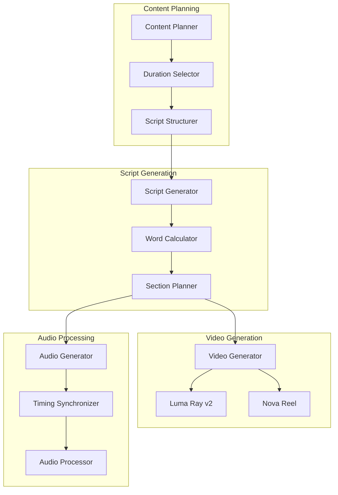

# Extended Video Duration Design

## Overview

This design document outlines the implementation approach for extending the YouTube Automation Platform to support video generation up to 5 minutes with comprehensive audio scripts. The solution maintains the existing dual-model architecture while adding intelligent content structuring and scalable processing capabilities.

## Architecture

### Current System Limitations

The current system is optimized for 8-second videos with:
- Fixed audio script length (~50-60 words)
- Simple SSML timing with basic pauses
- Single-segment content structure
- Optimized for short-form social media content

### Extended Duration Architecture



## Components and Interfaces

### Duration Configuration Interface

```typescript
interface ExtendedVideoConfig {
  durationSeconds: number; // 8-300 seconds
  targetWordCount: number; // Calculated based on duration
  contentStructure: ContentStructure;
  audioSettings: ExtendedAudioSettings;
}

interface ContentStructure {
  sections: ContentSection[];
  transitionStyle: 'smooth' | 'dramatic' | 'subtle';
  engagementLevel: 'high' | 'medium' | 'low';
}

interface ContentSection {
  title: string;
  duration: number; // seconds
  wordCount: number;
  purpose: 'introduction' | 'main_point' | 'supporting_detail' | 'conclusion';
  emphasis: boolean;
}
```

### Script Generation Engine

```typescript
interface ScriptGenerator {
  generateExtendedScript(config: ExtendedVideoConfig): Promise<ExtendedScript>;
  calculateWordCount(durationSeconds: number): number;
  structureContent(topic: string, duration: number): ContentStructure;
  optimizeForEngagement(script: string, duration: number): string;
}

interface ExtendedScript {
  fullScript: string;
  sections: ScriptSection[];
  totalWordCount: number;
  estimatedDuration: number;
  ssmlScript: string;
}

interface ScriptSection {
  content: string;
  startTime: number;
  endTime: number;
  wordCount: number;
  pauseAfter: number; // milliseconds
}
```

### Video Generation Adapter

```typescript
interface ExtendedVideoGenerator {
  generateLongFormVideo(prompt: string, duration: number): Promise<VideoResult>;
  handleSegmentedGeneration(segments: VideoSegment[]): Promise<VideoResult>;
  optimizeForDuration(config: VideoGenerationConfig): VideoGenerationConfig;
}

interface VideoSegment {
  prompt: string;
  duration: number;
  sequence: number;
  transitionType: string;
}
```

## Data Models

### Extended Content Model

```typescript
interface ExtendedContent {
  topic: string;
  category: string;
  duration: number;
  structure: {
    introduction: {
      duration: number;
      keyPoints: string[];
      hook: string;
    };
    mainContent: {
      sections: MainSection[];
      totalDuration: number;
    };
    conclusion: {
      duration: number;
      callToAction: string;
      summary: string;
    };
  };
  metadata: {
    targetAudience: string;
    complexity: 'beginner' | 'intermediate' | 'advanced';
    engagementGoal: string;
  };
}

interface MainSection {
  title: string;
  content: string;
  duration: number;
  visualCues: string[];
  transitionIn: string;
  transitionOut: string;
}
```

### Audio Timing Model

```typescript
interface ExtendedAudioTiming {
  totalDuration: number;
  wordsPerMinute: number; // Default: 150-180 WPM
  sections: AudioSection[];
  pauses: PauseDefinition[];
  emphasis: EmphasisDefinition[];
}

interface AudioSection {
  text: string;
  startTime: number;
  endTime: number;
  voice: string;
  rate: string;
  volume: string;
}

interface PauseDefinition {
  position: number; // Character position in script
  duration: number; // Milliseconds
  type: 'breath' | 'dramatic' | 'transition' | 'emphasis';
}
```

## Error Handling

### Duration Validation

```typescript
class DurationValidator {
  validateDuration(seconds: number): ValidationResult {
    if (seconds < 8) {
      return { valid: false, error: 'Minimum duration is 8 seconds' };
    }
    if (seconds > 300) {
      return { valid: false, error: 'Maximum duration is 5 minutes (300 seconds)' };
    }
    return { valid: true };
  }
  
  validateWordCount(wordCount: number, duration: number): ValidationResult {
    const minWords = Math.floor(duration * 2); // 2 words per second minimum
    const maxWords = Math.floor(duration * 3.5); // 3.5 words per second maximum
    
    if (wordCount < minWords || wordCount > maxWords) {
      return { 
        valid: false, 
        error: `Word count should be between ${minWords} and ${maxWords} for ${duration} seconds` 
      };
    }
    return { valid: true };
  }
}
```

### Processing Timeout Management

```typescript
interface ProcessingTimeouts {
  scriptGeneration: number; // 2 minutes
  videoGeneration: number; // 10 minutes for 5-minute videos
  audioGeneration: number; // 3 minutes
  videoProcessing: number; // 5 minutes
  totalTimeout: number; // 20 minutes maximum
}
```

## Testing Strategy

### Duration Testing Matrix

| Duration | Word Count | Sections | Test Scenario |
|----------|------------|----------|---------------|
| 30 seconds | 75-100 words | 2 sections | Short-form content |
| 1 minute | 150-200 words | 3 sections | Standard content |
| 2 minutes | 300-400 words | 4 sections | Medium-form content |
| 5 minutes | 750-900 words | 5-6 sections | Long-form content |

### Content Quality Tests

```typescript
interface ContentQualityTests {
  testScriptCoherence(script: ExtendedScript): QualityScore;
  testAudioSynchronization(audio: AudioResult, duration: number): SyncScore;
  testEngagementFlow(content: ExtendedContent): EngagementScore;
  testTransitionQuality(sections: ContentSection[]): TransitionScore;
}
```

### Performance Testing

```typescript
interface PerformanceTests {
  testGenerationTime(duration: number): Promise<PerformanceMetrics>;
  testMemoryUsage(videoSize: number): MemoryMetrics;
  testCostScaling(duration: number): CostProjection;
  testConcurrentGeneration(requests: number): ConcurrencyMetrics;
}
```

## Implementation Phases

### Phase 1: Script Generation Enhancement (High Priority)
1. **Extend Script Generator** - Support variable word counts based on duration
2. **Content Structuring** - Implement section-based content organization
3. **SSML Enhancement** - Advanced timing control for longer scripts
4. **Word Count Calculator** - Dynamic calculation based on duration and pacing

### Phase 2: Video Generation Adaptation (High Priority)
1. **Duration Parameter Support** - Update video generation APIs for extended duration
2. **Prompt Enhancement** - Create more detailed prompts for longer content
3. **Quality Optimization** - Maintain video quality across extended durations
4. **Fallback Handling** - Robust error handling for longer generation times

### Phase 3: Audio Processing Enhancement (Medium Priority)
1. **Extended Audio Generation** - Support for longer Polly synthesis
2. **Advanced SSML** - Complex timing and emphasis patterns
3. **Audio Segmentation** - Break long audio into manageable segments if needed
4. **Synchronization Optimization** - Perfect timing for extended content

### Phase 4: Infrastructure Scaling (Medium Priority)
1. **Lambda Configuration** - Increase timeouts and memory for extended processing
2. **S3 Optimization** - Handle larger file sizes efficiently
3. **Cost Monitoring** - Track and optimize costs for longer videos
4. **Performance Monitoring** - Monitor generation times and success rates

## Deployment Considerations

### Lambda Function Updates

```typescript
interface LambdaConfiguration {
  timeout: 900; // 15 minutes for extended processing
  memorySize: 3008; // Maximum memory for video processing
  ephemeralStorage: 10240; // 10GB for larger video files
  environment: {
    MAX_VIDEO_DURATION: '300';
    DEFAULT_WORDS_PER_MINUTE: '150';
    ENABLE_EXTENDED_GENERATION: 'true';
  };
}
```

### Cost Projections

| Duration | Video Cost | Audio Cost | Processing Cost | Total Cost |
|----------|------------|------------|-----------------|------------|
| 8 seconds | $0.060 | $0.015 | $0.005 | $0.080 |
| 1 minute | $0.450 | $0.045 | $0.015 | $0.510 |
| 2 minutes | $0.900 | $0.090 | $0.025 | $1.015 |
| 5 minutes | $2.250 | $0.225 | $0.050 | $2.525 |

### Storage Requirements

```typescript
interface StorageProjections {
  videoFile: {
    '8seconds': '1-2 MB',
    '1minute': '8-15 MB',
    '2minutes': '16-30 MB',
    '5minutes': '40-75 MB'
  };
  audioFile: {
    '8seconds': '200-300 KB',
    '1minute': '1.5-2 MB',
    '2minutes': '3-4 MB',
    '5minutes': '7.5-10 MB'
  };
}
```

## Monitoring and Analytics

### Extended Video Metrics

```typescript
interface ExtendedVideoMetrics {
  generationTime: number;
  wordCount: number;
  actualDuration: number;
  audioSyncAccuracy: number;
  engagementPrediction: number;
  costPerMinute: number;
  successRate: number;
}
```

### Quality Assurance

```typescript
interface QualityMetrics {
  scriptCoherence: number; // 0-100 score
  audioClarity: number; // 0-100 score
  videoQuality: number; // 0-100 score
  syncAccuracy: number; // Milliseconds deviation
  contentRelevance: number; // 0-100 score
}
```