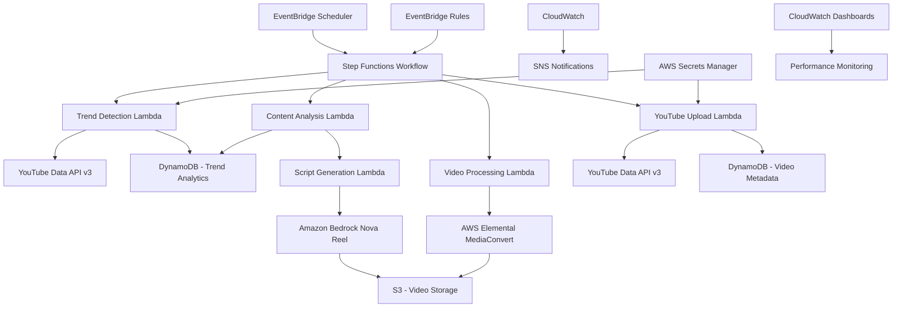
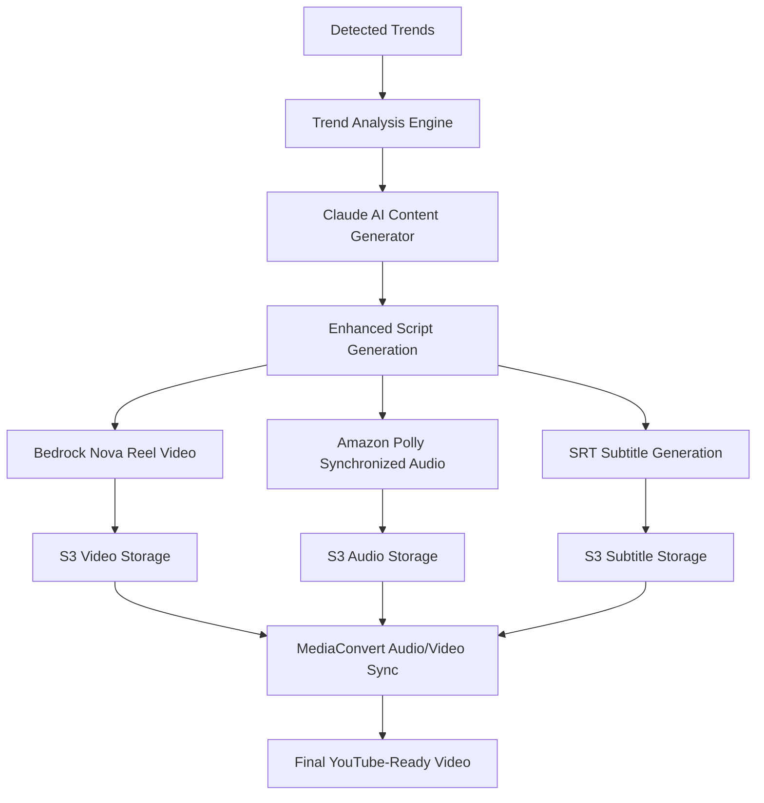

# Design Document

## Overview

The YouTube Automation Platform is a serverless, event-driven solution built on AWS that automatically detects trending topics, generates AI-powered video content, and uploads optimized videos to YouTube. The system uses AWS Step Functions as the central orchestration engine, with Amazon Bedrock Nova Reel for video generation, and various AWS services for data storage, processing, and monitoring.

The architecture follows serverless principles to ensure cost-effectiveness and automatic scaling, while maintaining reliability through comprehensive error handling and retry mechanisms.

## Architecture

### High-Level Architecture Diagram



### Core Components

**Orchestration Layer**
- AWS Step Functions: Central workflow orchestration with visual monitoring and error handling
- Amazon EventBridge Scheduler: Cron-based scheduling for automated pipeline execution
- EventBridge Rules: Event-driven triggers for asynchronous processing

**Data Layer**
- Amazon DynamoDB: Primary data store for trends, video metadata, analytics, and configuration settings
- Amazon S3: Video and audio storage with lifecycle policies for cost optimization
- AWS Secrets Manager: Secure storage for API credentials and OAuth tokens
- AWS Systems Manager Parameter Store: Configuration management for topics, prompts, and video settings

**Processing Layer**
- AWS Lambda: Serverless compute for all business logic components
- Amazon Bedrock Nova Reel: AI-powered text-to-video generation with audio narration
- Amazon Polly: Text-to-speech for high-quality audio narration
- AWS Elemental MediaConvert: Video processing, audio mixing, and YouTube optimization

**Integration Layer**
- YouTube Data API v3: Trend detection and video upload functionality
- Amazon API Gateway: RESTful endpoints for manual triggers and monitoring
- AWS SDK: Service integrations and cross-service communication

**Monitoring Layer**
- Amazon CloudWatch: Logging, metrics, and alerting
- AWS SNS: Notification delivery for errors and status updates
- AWS CloudTrail: Audit logging for security and compliance

## Components and Interfaces

### Step Functions Workflow States

**TrendDetectionState**
```json
{
  "Type": "Task",
  "Resource": "arn:aws:lambda:region:account:function:trend-detector",
  "Parameters": {
    "category": "tourism",
    "region": "US",
    "maxResults": 50
  },
  "Retry": [
    {
      "ErrorEquals": ["States.TaskFailed"],
      "IntervalSeconds": 30,
      "MaxAttempts": 3,
      "BackoffRate": 2.0
    }
  ],
  "Next": "ContentAnalysisState"
}
```

**EnhancedContentGenerationState**
```json
{
  "Type": "Task",
  "Resource": "arn:aws:lambda:region:account:function:enhanced-content-generator",
  "Parameters": {
    "trends.$": "$.detectedTrends",
    "topic.$": "$.topic",
    "trendId.$": "$.trendId",
    "videoConfig": {
      "fps": 24,
      "durationSeconds": 300,
      "dimension": "1280x720",
      "includeAudio": true,
      "includeSubtitles": true
    }
  },
  "TimeoutSeconds": 3600,
  "Next": "VideoProcessingState"
}
```

**TrendBasedContentAnalysisState**
```json
{
  "Type": "Task", 
  "Resource": "arn:aws:lambda:region:account:function:content-analyzer",
  "Parameters": {
    "trends.$": "$.detectedTrends",
    "topic.$": "$.topic",
    "contentRequirements": {
      "includeSpecificData": true,
      "includeActionableAdvice": true,
      "targetAudience": "general",
      "contentDepth": "comprehensive"
    }
  },
  "TimeoutSeconds": 1800,
  "Next": "EnhancedContentGenerationState"
}
```

### Lambda Function Interfaces

**TrendDetectorFunction**
```python
def lambda_handler(event, context):
    """
    Detects trending topics from YouTube Data API
    
    Input:
    {
        "category": "string",
        "region": "string", 
        "maxResults": int
    }
    
    Output:
    {
        "trends": [
            {
                "videoId": "string",
                "title": "string",
                "viewCount": int,
                "engagementRate": float,
                "keywords": ["string"]
            }
        ],
        "analysisTimestamp": "ISO8601"
    }
    """
```

**EnhancedVideoGeneratorFunction**
```python
def lambda_handler(event, context):
    """
    Generates video with synchronized audio and subtitles using trend-based content
    
    Input:
    {
        "trends": ["REIT", "Tesla", "AI stocks"],
        "topic": "investing", 
        "trendId": "string",
        "videoConfig": {
            "fps": int,
            "durationSeconds": int,
            "dimension": "string",
            "includeAudio": bool,
            "includeSubtitles": bool
        }
    }
    
    Output:
    {
        "videoS3Key": "string",
        "audioS3Key": "string", 
        "subtitlesS3Key": "string",
        "enhancedContent": {
            "videoPrompt": "string",
            "fullScript": "string", 
            "keyPoints": ["string"],
            "callToAction": "string"
        },
        "generationJobId": "string",
        "status": "COMPLETED|FAILED",
        "metadata": {
            "duration": int,
            "fileSize": int,
            "format": "string",
            "hasAudio": bool,
            "hasSubtitles": bool
        }
    }
    """
```

**TrendBasedContentAnalyzerFunction**
```python
def lambda_handler(event, context):
    """
    Analyzes trends and generates valuable, specific content prompts
    
    Input:
    {
        "trends": ["REIT", "Tesla", "Quantum Computing"],
        "topic": "investing|technology|education",
        "contentRequirements": {
            "includeSpecificData": bool,
            "includeActionableAdvice": bool,
            "targetAudience": "string"
        }
    }
    
    Output:
    {
        "enhancedPrompts": [
            {
                "trend": "REIT",
                "expandedPrompt": "Top 5 REITs to invest in 2025: Analyze Realty Income (O), Digital Realty Trust (DLR), Prologis (PLD), American Tower (AMT), and Crown Castle (CCI). Include dividend yields, growth prospects, and risk analysis.",
                "keyDataPoints": ["dividend yields", "occupancy rates", "FFO growth"],
                "actionableAdvice": ["specific investment amounts", "portfolio allocation", "timing strategies"]
            }
        ],
        "contentStrategy": {
            "primaryFocus": "string",
            "valueProposition": "string", 
            "targetKeywords": ["string"]
        }
    }
    """
```

### DynamoDB Table Schemas

**TrendAnalytics Table**
```json
{
  "TableName": "TrendAnalytics",
  "KeySchema": [
    {
      "AttributeName": "topic",
      "KeyType": "HASH"
    },
    {
      "AttributeName": "timestamp",
      "KeyType": "RANGE"
    }
  ],
  "AttributeDefinitions": [
    {
      "AttributeName": "topic",
      "AttributeType": "S"
    },
    {
      "AttributeName": "timestamp", 
      "AttributeType": "S"
    }
  ],
  "GlobalSecondaryIndexes": [
    {
      "IndexName": "EngagementIndex",
      "KeySchema": [
        {
          "AttributeName": "engagementScore",
          "KeyType": "HASH"
        }
      ]
    }
  ]
}
```

**VideoMetadata Table**
```json
{
  "TableName": "VideoMetadata",
  "KeySchema": [
    {
      "AttributeName": "videoId",
      "KeyType": "HASH"
    }
  ],
  "AttributeDefinitions": [
    {
      "AttributeName": "videoId",
      "AttributeType": "S"
    },
    {
      "AttributeName": "uploadDate",
      "AttributeType": "S"
    }
  ],
  "GlobalSecondaryIndexes": [
    {
      "IndexName": "UploadDateIndex",
      "KeySchema": [
        {
          "AttributeName": "uploadDate",
          "KeyType": "HASH"
        }
      ]
    }
  ]
}
```

## Enhanced Content Generation Architecture

### Trend-Based Content Pipeline

The enhanced content generation system creates valuable, specific content based on actual trending topics rather than generic templates.



### Content Enhancement Process

**Step 1: Trend Expansion**
- Input: Raw trend keywords (e.g., "REIT", "Tesla")
- Process: Expand into specific, valuable content topics
- Output: "Top 5 REITs to invest in 2025 with dividend analysis"

**Step 2: Research Integration**
- Use Claude AI to research current, factual information
- Include specific data points (stock tickers, performance metrics)
- Generate actionable advice and recommendations

**Step 3: Script Structuring**
- Create 800-1000 word narration scripts
- Include timestamps and strategic pauses
- Structure with intro, key points, examples, and call-to-action

**Step 4: Synchronized Production**
- Generate video prompt (under 400 characters for Bedrock)
- Create timed SSML for audio synchronization
- Generate SRT subtitles with proper timing

### Audio Synchronization System

**SSML Timing Control**
```xml
<speak>
  <prosody rate="medium" pitch="medium">
    <break time="0.5s"/>
    Welcome to today's investment analysis.
    <break time="1.0s"/>
    Today we're examining the top 5 REITs for 2025.
    <break time="0.8s"/>
    First, let's look at Realty Income, ticker symbol O.
    <break time="1.2s"/>
  </prosody>
</speak>
```

**Timing Calculation Algorithm**
```python
def calculate_audio_timing(script: str, video_duration: int) -> str:
    words = script.split()
    words_per_second = 2.5  # Average speaking rate
    target_words = int(video_duration * words_per_second)
    
    if len(words) > target_words:
        # Trim script to fit duration
        script = ' '.join(words[:target_words])
    
    sentences = script.split('.')
    pause_duration = (video_duration - len(sentences) * 2) / len(sentences)
    
    return create_timed_ssml(sentences, pause_duration)
```

### Content Value Framework

**Investing Content Requirements**
- Specific stock/ETF tickers and symbols
- Current performance data and metrics
- Risk analysis and considerations
- Actionable investment advice with amounts
- Market timing and strategy recommendations

**Technology Content Requirements**
- Specific companies and product names
- Current development status and timelines
- Impact analysis on consumers and businesses
- Future predictions with supporting evidence
- Practical applications and use cases

**Education Content Requirements**
- Step-by-step learning objectives
- Real-world examples and case studies
- Measurable outcomes and assessments
- Practical exercises and implementations
- Resource recommendations and next steps

## Data Models

### Trend Data Model
```python
@dataclass
class TrendData:
    topic: str
    timestamp: str
    video_id: str
    title: str
    view_count: int
    like_count: int
    comment_count: int
    engagement_rate: float
    keywords: List[str]
    category_id: str
    published_at: str
    channel_title: str
    
    def calculate_engagement_score(self) -> float:
        """Calculate weighted engagement score for trend ranking"""
        return (self.like_count * 0.4 + 
                self.comment_count * 0.6) / max(self.view_count, 1)
```

### Video Generation Model
```python
@dataclass
class VideoGenerationRequest:
    script_content: str
    video_config: VideoConfig
    source_trends: List[str]
    target_keywords: List[str]
    
@dataclass 
class VideoConfig:
    fps: int = 24
    duration_seconds: int = 600  # Default 10 minutes
    dimension: str = "1920x1080"
    quality: str = "high"
    include_audio: bool = True
    audio_config: AudioConfig = None

@dataclass
class AudioConfig:
    voice: str = "neural"
    speed: str = "medium"
    language: str = "en-US"
    output_format: str = "mp3"
    topic_vocabulary: List[str] = None
    
@dataclass
class GeneratedVideo:
    video_id: str
    s3_key: str
    duration: int
    file_size: int
    format: str
    generation_cost: float
    created_at: str
    bedrock_job_id: str
```

### YouTube Upload Model
```python
@dataclass
class YouTubeUploadRequest:
    video_s3_key: str
    title: str
    description: str
    tags: List[str]
    category_id: str
    privacy_status: str = "public"
    
@dataclass
class YouTubeVideo:
    youtube_id: str
    upload_date: str
    title: str
    description: str
    view_count: int = 0
    like_count: int = 0
    comment_count: int = 0
    revenue: float = 0.0
    source_trends: List[str]
    performance_metrics: Dict[str, Any]
```

## Error Handling

### Retry Strategies

**API Rate Limiting**
```python
class YouTubeAPIHandler:
    def __init__(self):
        self.max_retries = 5
        self.base_delay = 1
        
    @retry_with_exponential_backoff
    def call_youtube_api(self, request):
        try:
            response = youtube_service.execute(request)
            return response
        except HttpError as e:
            if e.resp.status == 429:  # Rate limit exceeded
                raise RetryableError("Rate limit exceeded")
            elif e.resp.status >= 500:  # Server errors
                raise RetryableError("YouTube server error")
            else:
                raise NonRetryableError(f"Client error: {e}")
```

**Video Generation Failures**
```python
class VideoGenerationHandler:
    def handle_generation_failure(self, error, attempt_count):
        if attempt_count < 3:
            if "quota_exceeded" in str(error):
                # Wait for quota reset
                return {"action": "retry", "delay": 3600}
            elif "content_policy" in str(error):
                # Modify script and retry
                return {"action": "modify_script", "delay": 60}
            else:
                # Generic retry with backoff
                return {"action": "retry", "delay": 2 ** attempt_count * 60}
        else:
            # Use fallback content or skip
            return {"action": "fallback", "delay": 0}
```

### Circuit Breaker Pattern
```python
class ServiceCircuitBreaker:
    def __init__(self, failure_threshold=5, recovery_timeout=300):
        self.failure_threshold = failure_threshold
        self.recovery_timeout = recovery_timeout
        self.failure_count = 0
        self.last_failure_time = None
        self.state = "CLOSED"  # CLOSED, OPEN, HALF_OPEN
        
    def call_service(self, service_function, *args, **kwargs):
        if self.state == "OPEN":
            if time.time() - self.last_failure_time > self.recovery_timeout:
                self.state = "HALF_OPEN"
            else:
                raise CircuitBreakerOpenError("Service unavailable")
                
        try:
            result = service_function(*args, **kwargs)
            self.reset()
            return result
        except Exception as e:
            self.record_failure()
            raise e
```

## Testing Strategy

### Unit Testing Approach

**Lambda Function Testing**
```python
import pytest
from moto import mock_dynamodb, mock_s3, mock_stepfunctions
from unittest.mock import patch, MagicMock

class TestTrendDetector:
    @mock_dynamodb
    @patch('youtube_service.search')
    def test_trend_detection_success(self, mock_youtube_search):
        # Setup
        mock_youtube_search.return_value = {
            'items': [
                {
                    'id': {'videoId': 'test123'},
                    'snippet': {'title': 'Test Video'},
                    'statistics': {'viewCount': '1000'}
                }
            ]
        }
        
        # Execute
        result = trend_detector.lambda_handler({
            'category': 'tourism',
            'region': 'US'
        }, {})
        
        # Assert
        assert len(result['trends']) == 1
        assert result['trends'][0]['videoId'] == 'test123'
```

**Integration Testing**
```python
class TestVideoGenerationPipeline:
    @pytest.mark.integration
    def test_end_to_end_video_generation(self):
        # Test complete pipeline from trend to upload
        trend_data = self.create_test_trend()
        
        # Execute pipeline
        execution_arn = stepfunctions_client.start_execution(
            stateMachineArn=TEST_STATE_MACHINE_ARN,
            input=json.dumps(trend_data)
        )
        
        # Wait for completion and verify
        result = self.wait_for_execution_completion(execution_arn)
        assert result['status'] == 'SUCCEEDED'
        
        # Verify video was uploaded to YouTube
        video_metadata = dynamodb_table.get_item(
            Key={'videoId': result['videoId']}
        )
        assert video_metadata['Item']['youtubeId'] is not None
```

### Performance Testing

**Load Testing Strategy**
```python
class LoadTestConfig:
    concurrent_executions = 10
    test_duration_minutes = 30
    ramp_up_time_minutes = 5
    
    scenarios = [
        {
            'name': 'peak_trend_analysis',
            'weight': 40,
            'function': 'trend_detector'
        },
        {
            'name': 'video_generation',
            'weight': 30, 
            'function': 'video_generator'
        },
        {
            'name': 'youtube_upload',
            'weight': 30,
            'function': 'youtube_uploader'
        }
    ]
```

**Cost Testing**
```python
class CostTestingFramework:
    def test_cost_per_video_generation(self):
        """Test that video generation stays within budget constraints"""
        start_time = time.time()
        
        # Generate test video
        result = self.generate_test_video()
        
        end_time = time.time()
        duration = end_time - start_time
        
        # Calculate costs
        lambda_cost = self.calculate_lambda_cost(duration)
        bedrock_cost = self.calculate_bedrock_cost(result['tokens_used'])
        storage_cost = self.calculate_s3_cost(result['file_size'])
        
        total_cost = lambda_cost + bedrock_cost + storage_cost
        
        # Assert cost is within acceptable range
        assert total_cost < 2.00, f"Video generation cost ${total_cost} exceeds budget"
```

### Monitoring and Alerting Testing

**CloudWatch Metrics Validation**
```python
class TestMonitoring:
    def test_custom_metrics_publishing(self):
        # Execute function that should publish metrics
        trend_detector.lambda_handler(test_event, test_context)
        
        # Verify metrics were published
        metrics = cloudwatch_client.get_metric_statistics(
            Namespace='YouTubeAutomation',
            MetricName='TrendsDetected',
            StartTime=datetime.utcnow() - timedelta(minutes=5),
            EndTime=datetime.utcnow(),
            Period=300,
            Statistics=['Sum']
        )
        
        assert len(metrics['Datapoints']) > 0
        assert metrics['Datapoints'][0]['Sum'] > 0
```

This design provides a comprehensive, scalable, and maintainable solution that addresses all the requirements while following AWS best practices for serverless architecture, error handling, and cost optimization.