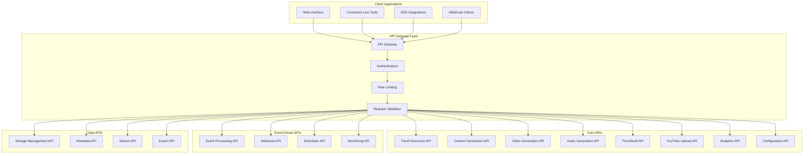

# YouTube Automation Platform - API Documentation

## 🔌 **API Overview**

The YouTube Automation Platform provides a comprehensive set of APIs for automated video content generation, processing, and publishing. All APIs are built on AWS Lambda functions with REST and event-driven interfaces.

## 🏗️ **API Architecture**



## 🎯 **Core APIs**

### **1. Trend Discovery API**

#### **Discover Trends**
```http
POST /api/v1/trends/discover
Content-Type: application/json
Authorization: Bearer {token}

{
  "categories": ["technology", "finance"],
  "sources": ["google-trends", "news-api", "social-media"],
  "timeframe": "24h",
  "confidenceThreshold": 0.7,
  "maxResults": 10
}
```

**Response:**
```json
{
  "success": true,
  "data": {
    "trends": [
      {
        "id": "trend_123",
        "keyword": "artificial intelligence",
        "category": "technology",
        "confidence": 0.85,
        "searchVolume": 150000,
        "growth": "+25%",
        "relatedTerms": ["AI", "machine learning", "automation"],
        "context": {
          "newsArticles": 45,
          "socialMentions": 1200,
          "marketData": {...}
        },
        "timestamp": "2025-01-03T10:00:00Z"
      }
    ],
    "totalResults": 8,
    "processingTime": "2.3s"
  }
}
```

#### **Get Trend Details**
```http
GET /api/v1/trends/{trendId}
Authorization: Bearer {token}
```

**Response:**
```json
{
  "success": true,
  "data": {
    "trend": {
      "id": "trend_123",
      "keyword": "artificial intelligence",
      "category": "technology",
      "confidence": 0.85,
      "detailedAnalysis": {
        "searchTrends": {...},
        "competitorAnalysis": {...},
        "contentOpportunities": {...}
      },
      "generatedContent": {
        "suggestedTitles": [...],
        "keyPoints": [...],
        "targetAudience": "..."
      }
    }
  }
}
```

### **2. Content Generation API**

#### **Generate Enhanced Content**
```http
POST /api/v1/content/generate
Content-Type: application/json
Authorization: Bearer {token}

{
  "trendId": "trend_123",
  "category": "technology",
  "contentType": "educational",
  "duration": 60,
  "style": "professional",
  "targetAudience": "general",
  "customPrompts": {
    "focus": "practical applications",
    "tone": "informative"
  }
}
```

**Response:**
```json
{
  "success": true,
  "data": {
    "contentId": "content_456",
    "enhancedContent": {
      "title": "Top 5 AI Tools Transforming Business in 2025",
      "description": "Discover the most impactful AI tools...",
      "script": "In today's rapidly evolving business landscape...",
      "keyPoints": [
        "AI automation tools",
        "Machine learning platforms",
        "Business intelligence AI"
      ],
      "callToAction": "Subscribe for more AI insights",
      "estimatedDuration": 58,
      "seoMetadata": {
        "tags": ["AI", "business", "technology", "2025"],
        "category": "Science & Technology",
        "keywords": ["artificial intelligence", "business tools"]
      }
    },
    "confidence": 0.92,
    "processingTime": "3.1s"
  }
}
```

### **3. Video Generation API**

#### **Generate Video**
```http
POST /api/v1/video/generate
Content-Type: application/json
Authorization: Bearer {token}

{
  "contentId": "content_456",
  "videoConfig": {
    "duration": 60,
    "resolution": "1280x720",
    "style": "professional",
    "visualTheme": "technology"
  },
  "customPrompt": "Create a professional video about AI tools with modern graphics"
}
```

**Response:**
```json
{
  "success": true,
  "data": {
    "videoId": "video_789",
    "status": "generating",
    "estimatedCompletion": "2025-01-03T10:05:00Z",
    "jobId": "bedrock_job_123",
    "webhookUrl": "https://api.example.com/webhooks/video-complete"
  }
}
```

#### **Get Video Status**
```http
GET /api/v1/video/{videoId}/status
Authorization: Bearer {token}
```

**Response:**
```json
{
  "success": true,
  "data": {
    "videoId": "video_789",
    "status": "completed",
    "progress": 100,
    "result": {
      "s3Location": "s3://bucket/videos/video_789.mp4",
      "duration": 58.5,
      "resolution": "1280x720",
      "fileSize": "15.2MB",
      "quality": "high"
    },
    "metadata": {
      "generationTime": "2m 45s",
      "cost": "$0.07",
      "bedrockJobId": "bedrock_job_123"
    },
    "completedAt": "2025-01-03T10:04:32Z"
  }
}
```

### **4. Audio Generation API**

#### **Generate Audio Narration**
```http
POST /api/v1/audio/generate
Content-Type: application/json
Authorization: Bearer {token}

{
  "contentId": "content_456",
  "audioConfig": {
    "voice": "Matthew",
    "speed": "medium",
    "style": "professional",
    "ssmlEnabled": true
  },
  "script": "In today's rapidly evolving business landscape..."
}
```

**Response:**
```json
{
  "success": true,
  "data": {
    "audioId": "audio_101",
    "status": "generating",
    "estimatedCompletion": "2025-01-03T10:02:00Z",
    "pollyJobId": "polly_job_456"
  }
}
```

#### **Get Audio Status**
```http
GET /api/v1/audio/{audioId}/status
Authorization: Bearer {token}
```

**Response:**
```json
{
  "success": true,
  "data": {
    "audioId": "audio_101",
    "status": "completed",
    "result": {
      "s3Location": "s3://bucket/audio/audio_101.mp3",
      "duration": 58.2,
      "format": "mp3",
      "quality": "high",
      "timingMarks": [
        {"time": 0, "type": "sentence", "value": "In today's rapidly evolving..."},
        {"time": 3.2, "type": "sentence", "value": "The first tool we'll explore..."}
      ]
    },
    "metadata": {
      "voice": "Matthew",
      "generationTime": "15s",
      "cost": "$0.004"
    }
  }
}
```

### **5. Thumbnail Generation API**

#### **Generate Thumbnail**
```http
POST /api/v1/thumbnail/generate
Content-Type: application/json
Authorization: Bearer {token}

{
  "contentId": "content_456",
  "thumbnailConfig": {
    "style": "technology",
    "template": "professional",
    "textOverlay": true,
    "colorScheme": "blue-purple-gradient"
  },
  "customElements": {
    "title": "Top 5 AI Tools",
    "subtitle": "2025 Edition",
    "branding": true
  }
}
```

**Response:**
```json
{
  "success": true,
  "data": {
    "thumbnailId": "thumb_202",
    "status": "generating",
    "estimatedCompletion": "2025-01-03T10:01:30Z",
    "titanJobId": "titan_job_789"
  }
}
```

### **6. YouTube Upload API**

#### **Upload Video to YouTube**
```http
POST /api/v1/youtube/upload
Content-Type: application/json
Authorization: Bearer {token}

{
  "videoId": "video_789",
  "audioId": "audio_101",
  "thumbnailId": "thumb_202",
  "metadata": {
    "title": "Top 5 AI Tools Transforming Business in 2025",
    "description": "Discover the most impactful AI tools...",
    "tags": ["AI", "business", "technology", "2025"],
    "category": "Science & Technology",
    "privacy": "public"
  },
  "scheduling": {
    "publishAt": "immediate"
  }
}
```

**Response:**
```json
{
  "success": true,
  "data": {
    "uploadId": "upload_303",
    "status": "uploading",
    "progress": 0,
    "estimatedCompletion": "2025-01-03T10:08:00Z",
    "youtubeJobId": "yt_job_456"
  }
}
```

#### **Get Upload Status**
```http
GET /api/v1/youtube/upload/{uploadId}/status
Authorization: Bearer {token}
```

**Response:**
```json
{
  "success": true,
  "data": {
    "uploadId": "upload_303",
    "status": "completed",
    "progress": 100,
    "result": {
      "youtubeUrl": "https://www.youtube.com/watch?v=ABC123DEF456",
      "videoId": "ABC123DEF456",
      "thumbnailUploaded": true,
      "subtitlesUploaded": true
    },
    "metadata": {
      "uploadTime": "45s",
      "fileSize": "15.2MB",
      "processingStatus": "succeeded"
    },
    "completedAt": "2025-01-03T10:07:23Z"
  }
}
```

## 📊 **Analytics APIs**

### **7. Analytics API**

#### **Get Performance Metrics**
```http
GET /api/v1/analytics/performance
Authorization: Bearer {token}
Query Parameters:
  - startDate: 2025-01-01
  - endDate: 2025-01-03
  - category: technology
  - metrics: views,engagement,cost
```

**Response:**
```json
{
  "success": true,
  "data": {
    "summary": {
      "totalVideos": 4,
      "totalViews": 1250,
      "totalCost": "$0.32",
      "averageCostPerVideo": "$0.08",
      "successRate": "100%"
    },
    "metrics": {
      "videoGeneration": {
        "successRate": 1.0,
        "averageTime": "3.2 minutes",
        "totalGenerated": 4
      },
      "costAnalysis": {
        "totalCost": 0.32,
        "breakdown": {
          "bedrockNovaReel": 0.28,
          "amazonPolly": 0.016,
          "bedrockClaude": 0.012,
          "other": 0.012
        }
      },
      "performance": {
        "categories": {
          "technology": {"videos": 2, "avgViews": 625},
          "finance": {"videos": 2, "avgViews": 625}
        }
      }
    },
    "trends": {
      "viewGrowth": "+15%",
      "engagementRate": "4.2%",
      "costEfficiency": "99% vs traditional"
    }
  }
}
```

#### **Generate Analytics Report**
```http
POST /api/v1/analytics/reports/generate
Content-Type: application/json
Authorization: Bearer {token}

{
  "reportType": "comprehensive",
  "dateRange": {
    "startDate": "2025-01-01",
    "endDate": "2025-01-31"
  },
  "filters": {
    "categories": ["technology", "finance"],
    "metrics": ["cost", "performance", "trends"]
  },
  "format": "json"
}
```

## 🔧 **Configuration APIs**

### **8. Configuration API**

#### **Get System Configuration**
```http
GET /api/v1/config/system
Authorization: Bearer {token}
```

**Response:**
```json
{
  "success": true,
  "data": {
    "categories": {
      "technology": {
        "defaultDuration": 30,
        "voiceStyle": "Matthew",
        "visualStyle": "modern-tech",
        "thumbnailStyle": "modern"
      },
      "finance": {
        "defaultDuration": 60,
        "voiceStyle": "Joanna",
        "visualStyle": "professional-finance",
        "thumbnailStyle": "professional"
      }
    },
    "scheduler": {
      "frequency": "rate(12 hours)",
      "maxVideosPerDay": 2,
      "enabled": true
    },
    "storage": {
      "hotDataRetention": 7,
      "warmDataRetention": 30,
      "coldDataRetention": 365
    }
  }
}
```

#### **Update Configuration**
```http
PUT /api/v1/config/category/{category}
Content-Type: application/json
Authorization: Bearer {token}

{
  "defaultDuration": 45,
  "voiceStyle": "Joanna",
  "visualStyle": "educational-clean",
  "contentStyle": "educational",
  "thumbnailStyle": "engaging"
}
```

## 🔄 **Event-Driven APIs**

### **9. Webhook API**

#### **Register Webhook**
```http
POST /api/v1/webhooks/register
Content-Type: application/json
Authorization: Bearer {token}

{
  "url": "https://your-app.com/webhooks/youtube-automation",
  "events": [
    "video.generation.completed",
    "audio.generation.completed",
    "youtube.upload.completed",
    "pipeline.completed"
  ],
  "secret": "your-webhook-secret"
}
```

#### **Webhook Event Payload Example**
```json
{
  "event": "pipeline.completed",
  "timestamp": "2025-01-03T10:08:00Z",
  "data": {
    "pipelineId": "pipeline_123",
    "contentId": "content_456",
    "videoId": "video_789",
    "audioId": "audio_101",
    "thumbnailId": "thumb_202",
    "uploadId": "upload_303",
    "youtubeUrl": "https://www.youtube.com/watch?v=ABC123DEF456",
    "totalCost": "$0.08",
    "processingTime": "4m 32s",
    "status": "success"
  }
}
```

## 🚀 **Batch Processing APIs**

### **10. Batch API**

#### **Create Batch Job**
```http
POST /api/v1/batch/create
Content-Type: application/json
Authorization: Bearer {token}

{
  "jobType": "multi-video-generation",
  "config": {
    "count": 5,
    "categories": ["technology", "finance"],
    "schedule": "immediate"
  },
  "trends": [
    {"keyword": "AI trends", "category": "technology"},
    {"keyword": "Investment strategies", "category": "finance"}
  ]
}
```

**Response:**
```json
{
  "success": true,
  "data": {
    "batchJobId": "batch_404",
    "status": "queued",
    "estimatedCompletion": "2025-01-03T10:25:00Z",
    "totalJobs": 5,
    "estimatedCost": "$0.40"
  }
}
```

## 📋 **API Response Codes**

| Code | Status | Description |
|------|--------|-------------|
| 200 | OK | Request successful |
| 201 | Created | Resource created successfully |
| 202 | Accepted | Request accepted for processing |
| 400 | Bad Request | Invalid request parameters |
| 401 | Unauthorized | Authentication required |
| 403 | Forbidden | Insufficient permissions |
| 404 | Not Found | Resource not found |
| 429 | Too Many Requests | Rate limit exceeded |
| 500 | Internal Server Error | Server error |
| 503 | Service Unavailable | Service temporarily unavailable |

## 🔐 **Authentication**

### **API Key Authentication**
```http
Authorization: Bearer your-api-key
```

### **OAuth2 Authentication**
```http
Authorization: Bearer your-oauth-token
```

## 📊 **Rate Limits**

| Endpoint | Rate Limit | Burst Limit |
|----------|------------|-------------|
| Trend Discovery | 100/hour | 10/minute |
| Content Generation | 50/hour | 5/minute |
| Video Generation | 20/hour | 2/minute |
| Audio Generation | 100/hour | 10/minute |
| YouTube Upload | 10/hour | 1/minute |
| Analytics | 1000/hour | 100/minute |

## 🛠️ **SDK Examples**

### **Node.js SDK**
```javascript
const YouTubeAutomation = require('@youtube-automation/sdk');

const client = new YouTubeAutomation({
  apiKey: 'your-api-key',
  region: 'us-east-1'
});

// Generate complete video pipeline
const result = await client.generateVideo({
  trend: 'artificial intelligence',
  category: 'technology',
  duration: 60
});

console.log(`Video created: ${result.youtubeUrl}`);
```

### **Python SDK**
```python
from youtube_automation import YouTubeAutomationClient

client = YouTubeAutomationClient(
    api_key='your-api-key',
    region='us-east-1'
)

# Generate complete video pipeline
result = client.generate_video(
    trend='artificial intelligence',
    category='technology',
    duration=60
)

print(f"Video created: {result.youtube_url}")
```

This API documentation covers all the core functionality of the YouTube Automation Platform, providing comprehensive endpoints for content generation, processing, and analytics.